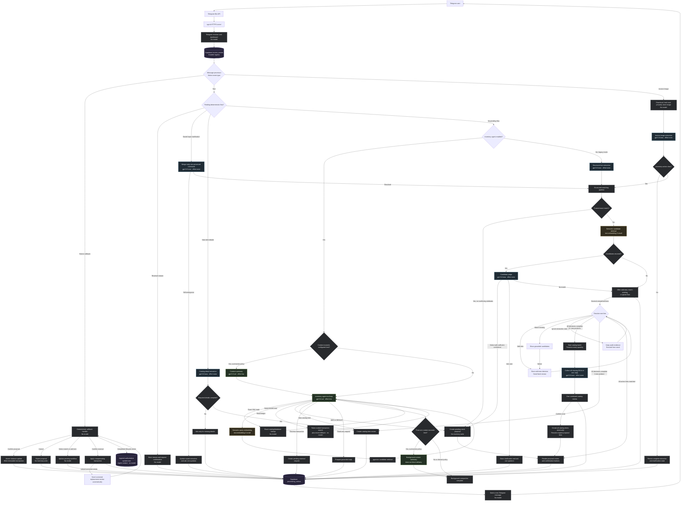
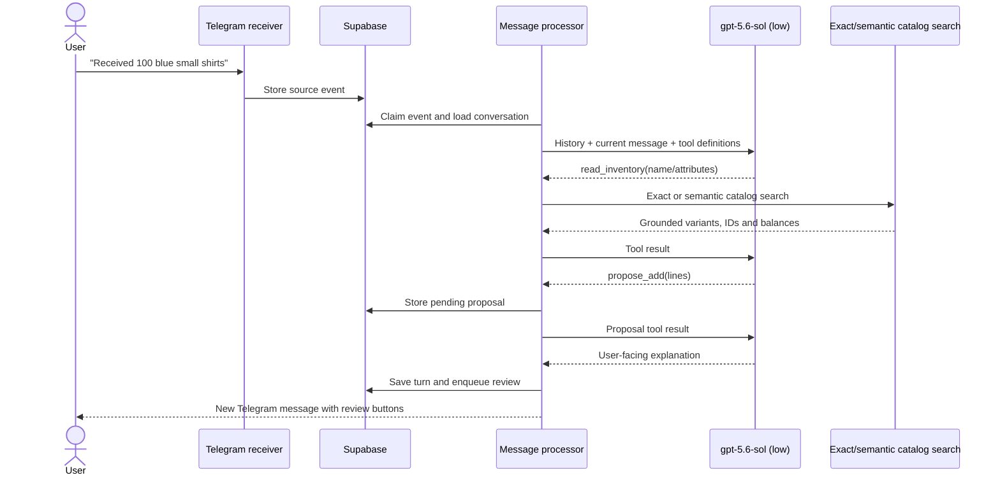
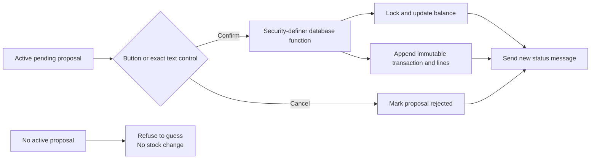
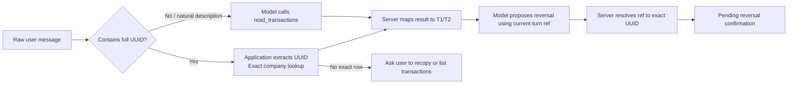

# Model and Action Flow

This document describes the model routing and inventory actions implemented by the
current prototype. It is intentionally a description of the code as it exists today,
including the older structured pipeline that remains available alongside the LLM-led text
agent.

## Current model assignments

| Component | Current model | Reasoning effort | When it is called |
|---|---|---:|---|
| Inventory agent | `gpt-5.6-sol` | `low` | An ordinary Telegram text message when no deterministic follow-up flow is pending and `INVENTORY_AGENT_ENABLED=true` |
| Structured text extraction | `gpt-5.6-luna` | `none` | Ordinary Telegram text only when `INVENTORY_AGENT_ENABLED=false`; this is currently the standby legacy path |
| Conversation context summary | `gpt-5.6-sol` | `low` | Only when active history exceeds its age, estimated-token, or item limit and the policy is `summarize` |
| Invoice image extraction | `gpt-5.6-luna` | `none` | Every supported Telegram invoice image |
| Input clarification resolution | `gpt-5.6-luna` | `none` | A natural-language reply to an ambiguous saved invoice or legacy structured command |
| Catalog detail extraction | `gpt-5.6-luna` | `none` | A natural-language reply while a new catalog item is waiting for required details |
| Bulk catalog detail extraction | `gpt-5.6-luna` | `none` | One natural-language reply supplies or explicitly generates missing identifiers for selected new products in any multi-line proposal |
| Candidate judge | `gpt-5.6-luna` | `none` | Retrieved candidates in the invoice/structured pipeline need a constrained select, ask-user, or no-match decision |
| Semantic retrieval | `text-embedding-3-small` | Not applicable | A name-based catalog search when the configured strategy is `semantic` or `hybrid`; exact SKU reads bypass it |

These are configuration defaults from `.env`. The development dashboard shows the
effective runtime values. Embeddings perform retrieval rather than conversational
reasoning, so reasoning effort does not apply to them.

## End-to-end switching flow

The input-clarification record is deliberately separate from ordinary conversation
history. It keeps the original structured line items and model audit metadata, scopes the
pending question to one organization member and Telegram chat, and routes the member's
next reply to a constrained resolver before the inventory agent. Once resolved, the saved
command continues through the same exact, semantic, candidate-judgment, and proposal
stages as an unambiguous invoice.

## Ordinary text-agent tool loop

One user message does not necessarily equal one OpenAI request. The inventory agent may
alternate between model responses and deterministic tool executions:

The agent loop permits at most six model/tool rounds. A typical mutation uses multiple
`gpt-5.6-sol` calls: one to request inventory data, another to request a proposal, and a
final one to explain the prepared proposal. Tool execution itself does not call the
conversational model, although a name-based `read_inventory` tool can call the embedding
model for semantic retrieval.

`read_inventory` labels name-query results as ranked candidates and includes each
candidate's match method and score. For an unqualified category-wide quantity question,
the agent requests the 50-result ceiling, evaluates every candidate, excludes incidental
matches, and returns a per-variant breakdown and total. If the user challenges that
answer, the agent rereads with broader criteria instead of treating the challenge as a
request to receive stock.

## Confirmation and mutation boundary

Models can read authoritative data and create pending proposals, but they cannot apply
inventory changes. Telegram buttons and the exact standalone `Confirm`/`Cancel` fallback
commands use deterministic code:

A reversal follows the same rule: the system creates a new opposite transaction. It never
edits or deletes the original applied transaction.

Transaction selection is deterministic even though the model conducts the conversation:

The displayed UUID remains useful to workers and auditors, but it is not accepted as a
model-supplied reversal argument. Current-turn references expire after each user message.
When a user says “the first one” later, the agent rereads the ledger and receives a fresh
mapping. Reusable conversation context retains user intent but strips old transaction
tool results and their assistant paraphrases; raw event traces remain in the dashboard.

## Runtime timing

Every model boundary and major deterministic stage emits a structured
`component_runtime` log with `duration_ms`. This covers webhook ingestion, conversation
storage, compaction, model rounds, OpenAI calls, embeddings, catalog and balance reads,
tools, outbox rendering, Telegram delivery, and total text-event duration. Timings are
emitted when real work happens; they are diagnostic measurements rather than heartbeats.
Post-turn compaction is scheduled after the outbox record is created and is logged as
`context_compaction_background`; it is not included in the current
`telegram_text_event_total`. A following turn in the same conversation logs
`context_compaction_wait_before_turn` if it must wait for that task before loading history.

## Important routing notes

- The API never calls OpenAI. It authenticates and stores Telegram updates quickly.
- The worker owns all model calls, matching, proposal creation and outbound delivery.
- The inventory agent is the active ordinary-text path because
  `INVENTORY_AGENT_ENABLED=true`.
- Structured text extraction remains implemented but is not called for ordinary text
  while the inventory agent is enabled.
- Candidate judgment remains part of invoice and legacy structured matching. The ordinary
  text agent examines catalog results itself.
- Exact SKU reads query the database directly. Semantic embeddings are used for
  name-based retrieval, not for exact identifiers or broad inventory listings.
- Context summarisation is conditional housekeeping, not an automatic call on every turn.
- Post-turn context compaction runs in the background, so Telegram delivery does not wait
  for a summary. A subsequent turn in the same user/chat is serialized behind that task
  and reloads durable context afterward.
- Button callbacks and exact standalone proposal controls do not call a model.
- Successful confirmation and cancellation actions append a deterministic system turn to
  active agent context. The next agent turn can see that lifecycle result but must still
  read the authoritative transaction ledger before a correction or reversal.
- Typed proposal controls target only the proposal currently attached to that actor and
  chat. They never infer a target from old pending rows.
- Filtered ledger reads rank normalized query tokens and automatically include recent
  fallback transactions. A failed literal phrase can no longer establish that no
  transaction exists.
- Reversal applies to a complete transaction. Correcting one line requires reversing the
  original transaction and then confirming a corrected replacement.
- Voice-note transcription is not yet implemented in the current worker and is therefore
  not shown as an active branch.

## Auditing a real message

Use the development dashboard to compare this design with a real execution:

1. **Flow inspector** shows the Telegram event, model/tool history, matching evidence,
   proposal, outbox and transaction.
2. **Conversations** shows active history, compacted turns and the rolling summary.
3. **Models & prompts** shows the exact prompt and tool contract for every model component.
4. **Configuration** shows the effective model names, efforts and matching settings.

The immutable records in Supabase remain authoritative when a dashboard trace and this
architecture document differ.
